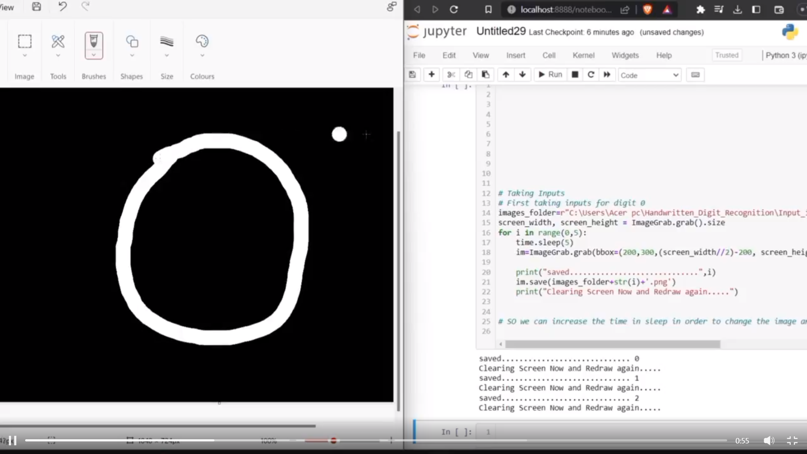
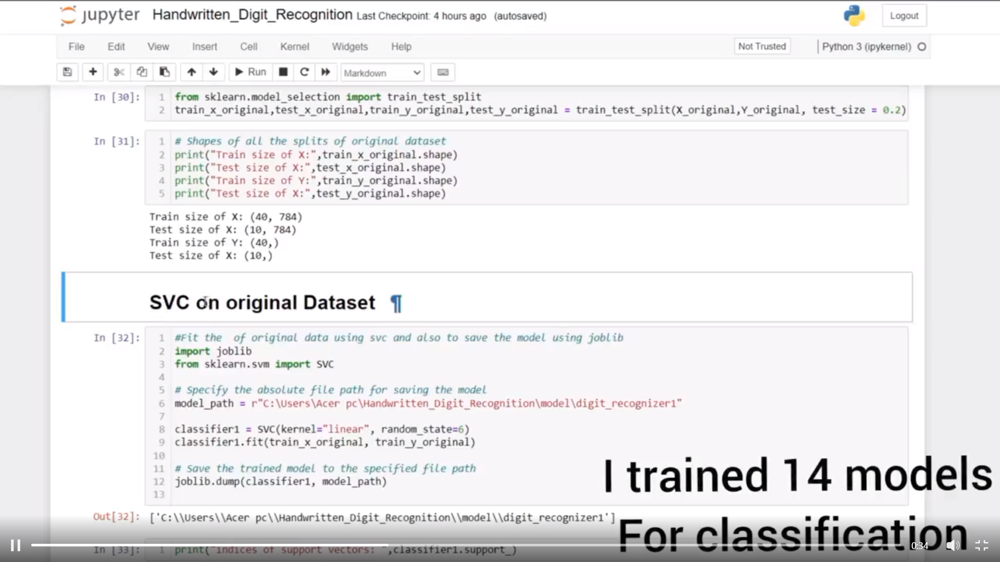
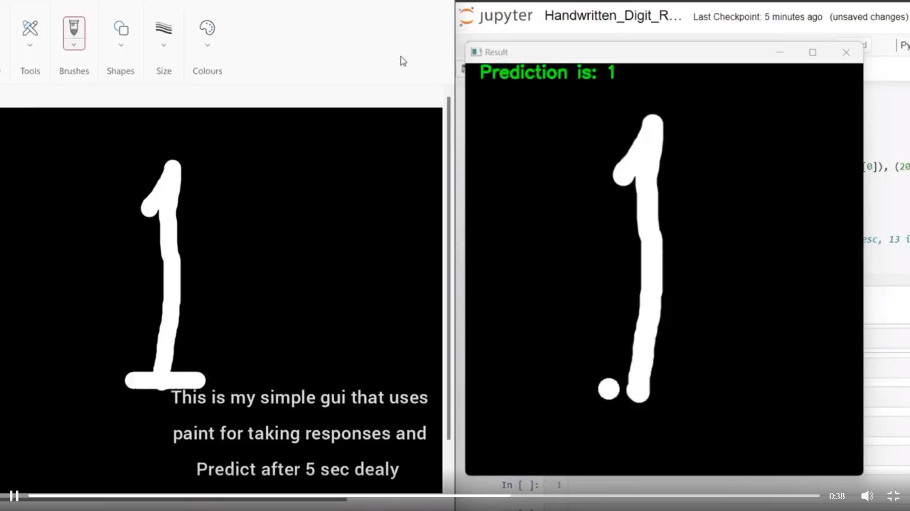
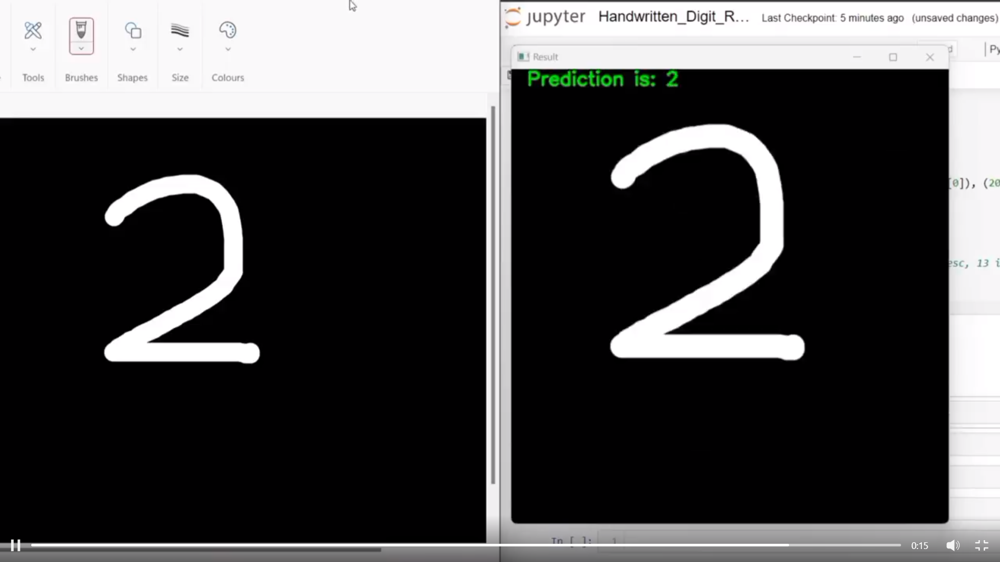

# Handwriting Digit Recognition Project Project 1

|  |  |  |  |
| :---: | :---: | :---: | :---: |
| Day 1 | Day 2 | Day 3 | Day 4 |

This repository contains my progress on the Handwriting Digit Recognition project for the #100days25projectchallenge. Each day, I documented my updates and achievements.

## Table of Contents

- [Day 1 Update](#day-1-update)
- [Day 2 Update](#day-2-update)
- [Day 3 Update](#day-3-update)
- [Day 4 Update](#day-4-update)
- [Project Details](#project-details)

## Day 1 Update

🚀 Project 1 Day 1 Update! 📝

Excited to share my progress on Handwriting Digit Recognition for the #100days25projectchallenge! 🤩 Today, I focused on generating my own dataset and exploring data augmentation techniques. I started by creating digit images using Paint and captured them using pyscreenshot. It was a fun process! 😄

To enrich my dataset, I applied data augmentation techniques, transforming just 5 images per digit into 500 unique images. This involved techniques like rotation, scaling, and translation. It was challenging, but I persisted and successfully generated a diverse dataset!

I organized my dataset into two sets: `df_original` containing the original digit images, and `df_ag` containing the augmented images. This division will help me compare the performance of my models later on.

In addition, I'm planning to take this project a step further by creating a simple GUI to enhance the user experience and showcase the digit recognition capabilities.

Overall, it was an engaging day spent on image generation, augmentation, and preparing for the next steps. I invested around 3 hours to understand and implement the techniques effectively. 💡

Stay tuned for tomorrow's update! I'll be diving into preprocessing and exploring different machine learning algorithms for digit recognition. Let's keep the momentum going! 💪🔥

Check out my progress on [LinkedIn Day 1 Post](https://www.linkedin.com/posts/avdhesh-kumar-sharma-751a49225_100days25projectchallenge-100days25projectchallenge-activity-7062363237886959616-YeLp?utm_source=share&utm_medium=member_desktop).

## Day 2 Update

🚀 Project 1 Day 2 Update! 📝

Today, I made significant progress in preprocessing the dataset for my Handwriting Digit Recognition project as part of the #100days25projectchallenge.

I began by thoroughly examining the dataset, checking for null values, and splitting it into features and labels. To ensure accuracy, I handled the original and augmented data separately, organizing them meticulously for further analysis.

In order to gain deeper insights into the dataset, I utilized the power of matplotlib to visually explore both the original and augmented images. This allowed me to unravel the intricate variations present in the digit samples and develop a comprehensive understanding of the data.

Moving forward, I trained a total of 14 models using the preprocessed data, employing diverse algorithms such as SVC, RFC, GradientBoosting, NaiveBayes, and KNN with various parameters. After rigorous evaluation, the KNN model with 1 neighbor emerged as the clear frontrunner, showcasing exceptional performance. The original dataset achieved an accuracy of 60%, while the augmented dataset displayed an impressive accuracy of 93%. This stark contrast was expected, considering the limited size of the original dataset for training.

Looking ahead to tomorrow, my focus will shift towards creating a simplified and intuitive GUI for the project. By harnessing the capabilities of different libraries, I aim to develop an engaging user interface that seamlessly demonstrates the remarkable digit recognition capabilities of my project.

Stay tuned for tomorrow's update as I delve deeper into GUI development, aiming to enhance the project's accessibility and visual appeal. Let's maintain the unwavering momentum! 💪🔥

Check out my progress on [LinkedIn Day 2 Post](https://www.linkedin.com/posts/avdhesh-kumar-sharma-751a49225_100days25projectchallenge-100days25projectchallenge-activity-7062787769483296769-vx7O?utm_source=share&utm_medium=member_desktop).

## Day 3 Update

🚀 Project 1 Day 3 Update! 📝

Today, despite a slow start, I made progress in my Handwriting Digit Recognition project for the #100days25projectchallenge. In just 1.5 hours, I accomplished three crucial tasks that set the foundation for tomorrow's work.

Firstly, I summarized the project's tables, organizing columns with classification real names, accuracy, and model names. This summary provides a clear overview of different models' performance and their corresponding accuracies.

Next, I explored real-time demo prediction using a paint application. I implemented a feature that allows me to draw digits in real-time and witness the model's predictions with a 5-second delay. It's an exciting experience to see the system in action!

Additionally, I took the necessary step of converting a few problematic cells into RawNB format. These cells were overwriting my images whenever I restarted the kernel. This modification will help preserve the images and prevent any unintended data loss.

Lastly, I researched various GUI-making libraries and found tkinter to be a versatile and user-friendly option. Tomorrow, I plan to utilize tkinter to develop an impressive GUI for my project.

However, I encountered a challenge with occasional misclassifications. The model sometimes mistakes the digit 2 for 5, 4 for 9, and 3 for 5. This impacts the accuracy of the system.

To address this issue, I have two options. One is to proceed with the GUI development and focus on improving the model later. The other is to enhance the model first and then work on the GUI. I'll make a decision tomorrow after further analysis.

Stay tuned for tomorrow's update as I delve into GUI development and continue to refine my Handwriting Digit Recognition project. Let's conquer the challenges together! 💪🔥

Check out my progress on [LinkedIn Day 3 Post](https://www.linkedin.com/posts/avdhesh-kumar-sharma-751a49225_100days25projectchallenge-100days25projectchallenge-activity-7063143354485620736-Vu6Y?utm_source=share&utm_medium=member_desktop).

## Day 4 Update

🚀 Project 1 Day 4 Update! 📝

Today, I made significant progress in my Handwriting Digit Recognition project as part of the #100days25projectchallenge. In just 2 hours, I accomplished a crucial task that greatly enhanced the project's usability and visual appeal.

I successfully developed a GUI using the tkinter library. This intuitive interface enables users to draw digits and witness the real-time predictions made by the model. By leveraging various tkinter widgets, I created an interactive space where users can experiment with their handwriting and observe the system's accuracy.

Furthermore, I implemented an accuracy tracker that displays the current accuracy of the model based on the user's drawings. This feature provides valuable insights into the system's performance, allowing users to gauge the effectiveness of the model in real-time.

During the GUI development process, I encountered a challenge related to misclassifications. The model occasionally struggled with differentiating between similar digits, such as 2 and 5, 4 and 9, and 3 and 5. This issue impacted the accuracy of the predictions.

To overcome this challenge, I plan to explore more advanced machine learning techniques and algorithms that can further enhance the model's performance. This includes implementing deep learning approaches like convolutional neural networks (CNN) to leverage the spatial relationships present in the digit images.

Stay tuned for future updates as I continue to refine my Handwriting Digit Recognition project. Let's keep pushing the boundaries and striving for excellence! 💪🔥

Check out my progress on [LinkedIn Day 4 Post](https://www.linkedin.com/posts/avdhesh-kumar-sharma-751a49225_100days25projectchallenge-github-neuralnetworks-activity-7063505737846538240-xVdz?utm_source=share&utm_medium=member_desktop).

## Project Details

- Project: Handwriting Digit Recognition
- Challenge: #100days25projectchallenge
- Repository: [GitHub](https://github.com/yourusername/handwriting-digit-recognition)

---

This project is a part of the #100days25projectchallenge, where I take on the challenge of building 25 projects in 100 days. The goal is to enhance my coding skills, explore new technologies, and develop a portfolio of diverse projects.

Stay tuned for more updates as I continue my coding journey! Let's learn, build, and grow together! 💻🚀

---

Feel free to connect with me on [LinkedIn](https://www.linkedin.com/in/yourname/) for further discussions and collaborations. Let's connect and inspire each other! 🤝🌟
